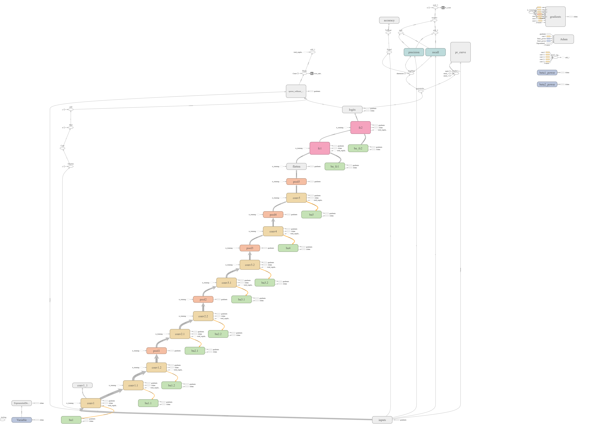
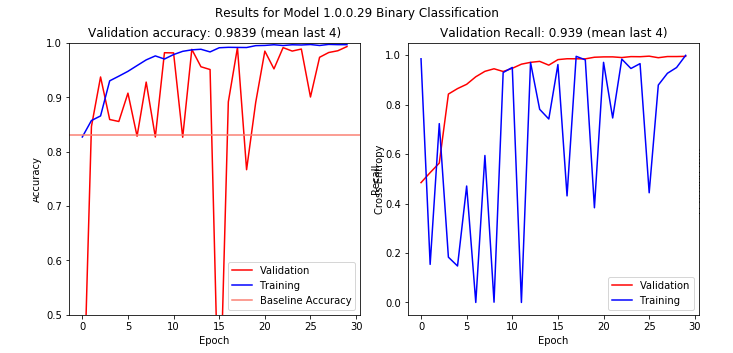
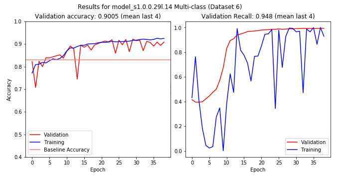

# ConvNets for Detection of Abnormalities in Mammograms
Eric Scuccimarra (skooch@gmail.com)

## Introduction
Breast cancer is the second most common cancer in women worldwide. About 1 in 8 U.S. women (about 12.4%) will develop invasive breast cancer over the course of her lifetime. The five year survival rates for stage 0 or stage 1 breast cancers are close to 100%, but the rates go down dramatically for later stages: 93% for stage II, 72% for stage III and 22% for stage IV. Human recall for identifying lesions is estimated to be between 0.75 and 0.92 [1], which means that as many as 25% of abnormalities may go undetected. 

The DDSM is a well-known dataset of normal and abnormal scans, and one of the few publicly available datasets of mammography imaging. Unfortunately, the size of the dataset is relatively small. To increase the amount of training data we extract the Regions of Interest (ROI) from each image, perform data augmentation and then train ConvNets on the augmented data. The ConvNets were trained to predict both whether a scan was normal or abnormal, and to predict whether abnormalities were calcifications or masses and benign or malignant.

## Related Work
There exists a great deal of research into applying deep learning to medical diagnosis, but privacy concerns make the availability of training data a limiting factor, and thus there is not much research into applying ConvNets to mammography. [1, 4] use ConvNets to classify pre-detected breast masses by pathology and type, but do not attempt to detect masses from scans. [2,3] detect abnormalities using combinations of region-based CNNs and random forests. 

## Datasets
The DDSM [6] is a database of 2,620 scanned film mammography studies. It contains normal, benign, and malignant cases with verified pathology information. The DDSM is saved as Lossless JPEGs, an archaic format which has not been maintained in about 20 years. The CBIS-DDSM [8] collection includes a subset of the DDSM data selected and curated by a trained mammographer. The CBIS-DDSM images have been pre-processed and saved as Dicom images, and thus are better quality than the DDSM images, but this dataset only contains scans with abnormalities. In order to create a dataset which can be used to predict the presence of abnormalities, the ROIs were extracted from the CBIS-DDSM dataset and combined with normal images taken from the DDSM dataset.

The MIAS dataset is a very small set of mammography images, consisting of 330 scans of all classes. The scans are standardized to a size of 1024x1024 pixels. The size of the dataset made this unusable for training.

Data from the University of California Irvine Machine Learning Repository [5] was also used for exploratory data analysis to gain insight into the characteristics of abnormalities.

## Methods

### Data Preprocessing and Augmentation
Images from both the CBIS-DDSM and the DDSM datasets were pre-processed to extract the ROIs into images of a size suitable to train a ConvNet on. Multiple datasets were created of differing sizes using different extraction methods and amounts of data augmentation. Then these datasets were used to train several ConvNets, including custom designed architectures as well as customized variations on VGG and Inception.

#### Training Datasets
Multiple datasets were created using different techniques and amounts of data augmentation. The datasets ranged in size from 27,000 training images to 62,000 training images. 

1. Dataset 5 consisted of 39,316 images. This dataset was the first to use data augmentation so that each ROI was represented in multiple ways. However, this dataset did not properly separate training and test data, so was not useable for evaluating models.
2. Dataset 6 consisted of 62,764 images. This dataset was created using an "everything but the kitchen street" approach to the ROI extraction, combining elements of both extraction methods described below. Each ROI was extracted at size, zoomed in or out depending on its size, cropped and with random rotation and flipping.   
3. Dataset 8 consisted of 40,559 images. This dataset used the extraction method 1 described below to provide greater context for each ROI.  
4. Dataset 9 consisted of 43,739 images. The previous datasets had used zoomed images of the ROIs, which was problematic as it required the ROI to be pre-identified and isolated. This dataset was created using extraction method 2 with the goal of training a ConvNet to recognize abnormalities from un-augmented input images.

### ROI Extraction of CBIS-DDSM Images
The CBIS-DDSM scans were of relatively large size, with a mean height of 5295 pixels and a mean width of 3131 pixels. Masks highlighting the ROIs were provided. The masks were used to extract the ROI by creating a square around the white areas of the mask. 

Using the mask, the ROIs were extracted at 598x598 and then sized down to 299x299. To increase the size of the training data, each ROI was extracted multiple times using the methodologies described below. The size and variety of the data was also increased by randomly horizontally flipping each tile, randomly vertically flipping each tile, randomly rotating each tile, and by randomly positioning each ROI within the tile.

#### ROI Extraction Method 1
The analysis of the UCI data indicated that the edges of an abnormality were important as to determining its pathology and type, and this was confirmed by a radiologist. Levy et al [1] also report that the inclusion of context was an important contributor to the accuracy of the classification.

The ROIs had a mean size of 450 pixels and a standard deviation of 396. In the interest of representing each ROI as well as possible, each ROI was extracted in multiple ways:

1.	The ROI was extracted at 598x598 at its original size.
2.	The ROI was zoomed to 598x598, with padding to provide context.
3.	If the ROI had the size of one dimension more than 1.5 times the other dimension it was extracted as two tiles centered in the center of each half of the ROI along it's largest dimension.

#### ROI Extraction Method 2
In order to create a dataset which could be used to train a network to predict if scans were normal or abnormal without resizing them different augmentation techniques were used. For this method the ROIs were not zoomed.

1. If the ROI was smaller than a 598x598 tile it was extracted with 20% padding on either side. 
2. If the ROI was larger than a 598x598 tile it was extracted with 5% padding.
3. Each ROI was then randomly cropped three times using random flipping and rotation.

#### Normal Images
The normal scans from the DDSM dataset did not have ROIs so were processed differently. As these images had not been pre-processed they contained artifacts such as white borders and white patches of pixels used to cover up personal identifying information. To remove the borders each image was cropped by 7% on each side. 

In order to attempt to keep these images on the same scale as the CBIS-DDSM images, the DDSM images were sized down by a random factor between 1.8 and 3.2, then segmented into 299x299 tiles with a variable stride between 150 and 200. Each tile was then randomly rotated and flipped.
 
To avoid the inclusion of images which contained overlay text, or were mostly black background, each tile was then added to the dataset only if it met upper and lower thresholds on mean and variance. The thresholds were determined through random sampling of tiles and tuning of the thresholds to eliminate images which did not contain usable data. 

#### Data Balance
Only about 10% of mammograms are abnormal, in order to maximize recall we weighted our training data more heavily towards abnormal scan, with a target of 85% normal. As each ROI was extracted to multiple images, in order to prevent different images of the same ROI appearing in both the training and test data, the existing divisions of the CBIS-DDSM data were maintained. The test data was divided evenly between test and validation data with no shuffling to avoid overlap.

The normal images had no overlap, so were shuffled and divided among the training, test and validation data. The final divisions were 80% training, 10% test and 10% validation.

### Labels
In the DDSM dataset the scans are grouped into the following categories:
1.	Normal
2.	Benign Calcification
3.	Malignant Calcification
4.	Benign Mass
5.	Malignant Mass

As previous work [1] has already dealt with classifying pre-identified abnormalities, we focused on classifying images as normal or abnormal.

When classifying into all five categories, the predictions were also "collapsed" into binary normal/abnormal in order to measure the precision and recall. 

### ConvNet Architecture
Our first thought was to train existing ConvNets, such as VGG or Inception, on this dataset. However a lack of computational resources made this impractical. In addition, the features of medical scans contain much less variance than does the ImageNet data, so we were concerned that using a large model with a lot of parameters, like VGG, would lead to overfitting. For these reasons we decided to design our own architecture specifically for this task, attempting to keep the models as simple as possible. 

We started with a simple model based on VGG, consisting of stacked 3x3 convolutional layers alternating with max pools followed by fully connected layers. Our model had fewer convolutional layers than did VGG and smaller fully connected layers. This architecture was iteratively improved, with each iteration changing only one aspect in the architecture and then being evaluated. Techniques evaluated include Inception-style branches [16, 17, 18] and residual connections [19]. 

The architectures were designed so that the same scripts could be used to create a model for binary classification as well as for multi-class classification through a command line parameter.

We used a weighted cross-entropy loss function in order to maximize recall and compensate for the unbalanced nature of the dataset. Positive examples were weighted from 2 to 3 times more than negative examples.

The models were constructed using TensorFlow and metrics were logged to TensorBoard. Batch normalization [15] was used for every layer, with dropout applied to the fully connected and pooling layers, and L2 regularization applied to all layers, with different lambdas for convolutional layers and fully connected layers.

The best performing architecture will be detailed below.

### Training
At first, initial evaluation of models was done using Dataset 5 due to its relatively small size. Each model was trained through between 30 and 50 epochs and accuracy, precision and recall were used to evaluate performance. It is likely that Dataset 5 has different images of the same scans included in both the training and validation sets, so the validation results on this dataset were essentially useless and all models had to be retrained on other datasets.

### Transfer Learning
We had considered using transfer learning from VGG or Inception, but decided that the features of the ImageNet data were different enough from those of radiological scans that it made more sense to learn the features from scratch on this dataset. To evaluate the usefulness of transfer learning from pre-trained networks, VGG-19 and Inception v3, the features were extracted from our datasets using pre-trained versions of these models. The final layers of the networks were then retrained to classify to our classes while the convolutional weights were frozen. Our hypothesis that the features extracted by these networks would not be applicable to classifying medical scans seemed to be confirmed by the results of this experiment, which were significantly below the accuracy of the most-frequent baseline.

Transfer learning did, however, proof very useful in training our own networks, where initializing the convolutional weights to weights pre-trained on our datasets greatly sped up the training process. However, this method was not entirely reliable. When trained past 15-25 epochs or so, most of our models began to overfit the training data, and continuing to train a pre-trained model usually led to substantial drops in validation accuracy unless the convolutional weights were frozen. Our approach to handling this was to train a model on multi-class classification for 15-20 epochs, under the assumption that this would train the network to extract the most relevant features, and then re-training the network for binary classification for 5-10 epochs. The re-training was done both with and without the convolutional layers frozen.   

## Results
### Architecture
The custom model which performed the best was 1.0.0.29, which was based on VGG. Model 1.0.0.29 consists of stacked 3x3 convolutions alternating with max pools followed by two fully connected layers with 2048 units each. 

Model 1.0.0.45 was almost identical to 1.0.0.29, but the input data was centered and scaled, and there was an optional online contrast enhancement. 

A variety of other models were evaluated which included things like Inception-style branches and residual connections, and while some performed well during some training runs, the majority did not generalize to the validation data - they learned to predict the validation and test examples as either all positive or all negative.

A slightly modified version of VGG-16 was also trained as a benchmark. A full version of VGG-16 required more memory than we had available, so we made the following alterations to the architecture:

1. The architecture was altered to accept 299x299 images as input
2. The stride of the first convolutional layer was changed to 2
3. The first fully connected layer had 1024 units instead of 4096, and the second fully connected layer had 512 units.
4. Batch normalization was included after every layer

These changes brought the memory requirements down to acceptable levels and doubled the training speed. While changing the stride of convolutional layer 1 decreased the training accuracy, we felt that it might allow the model to generalize a bit better.

Finally we attempted to train a customized version of Inception v4 on our datasets, however the training was so slow it was abandoned.

### Performance

The performance of the models turned out to be highly dependent on the dataset used for training combined with the classification method. Unsurprisingly, all models performed better on binary classification than on multi-class classification on all datasets, even dataset 8 which was created specifically for multi-class classification. 

Table 1 below shows the accuracy and recall on the test dataset for selected models.

|Model          |Classification |Dataset    |Epochs |Accuracy    |Recall      |Initialization |
|---------------|---------------|-----------|-------|------------|------------|---------------|
|VGG-16.03.04b.9|         Binary|          9|30     |.8881       |.3589       |Scratch        |
|VGG-16.03.04l.6|    Multi-class|          6|20     |.8333       |.0288       |Scratch        |
|VGG-16.03.04b.8|         Binary|          8|10     |       |       |VGG-16.03.04l6        |
|1.0.0.29n      |    Multi-class|          6|40     |.9142       |.9353       |Scratch        |
|1.0.0.29n      |         Binary|          6|35     |.8299       |.0477       |Scratch        |    
|1.0.0.46l      |    Multi-class|          6|20     |.8187       |0.0         |Scratch        |
|1.0.0.46b      |         Binary|          6|5      |.8338       |0.0         |1.0.0.45l      |
|1.0.0.46b      |         Binary|          6|20     |.1810       |1.0         |Scratch        |
|1.0.0.29n      |    Multi-class|          8|35     |.8890       |.9092       |Scratch        |
|1.0.0.29n      |         Binary|          8|30     |.9930       |1.0         |Scratch        |
|1.0.0.46l      |    Multi-class|          8|20     |.1139       |1.0         |Scratch        |
|1.0.0.46b      |         Binary|          8|10     |.9896       |.9776       |1.0.0.46l.6    |
|1.0.0.46b      |         Binary|          8|5      |.8711       |.9434       |1.0.0.45l.8*   |
|1.0.0.46b      |         Binary|          8|30     |.5434       |.7549       |Scratch        |
|1.0.0.46l      |    Multi-class|          9|     |       |       |     |
|1.0.0.46b      |         Binary|          9|30     |.8370       |.0392       |Scratch        |

<small>\* only fully connected layers re-trained</small>              

<i>Table 1: Performance on Test Set</i>

Model 1.0.0.29 performed excellent on both the training and validation data, as seen in Figures 1 and 2.

 
<i>Figure 1 - Binary Accuracy and Recall for Model 1.0.0.29</i>

 
<i>Figure 2 - Multi-class Accuracy and Recall for Model 1.0.0.29</i>

Many of the models appeared to be unstable in that training the same model on the same dataset could produce drastically different results. We assume that this is due to the model learning to recognize features which did not generalize to the test data and attempted to combat this by keeping the size of the models small.

In general, most models evaluated seemed to overfit the training data very quickly. Once the model started to overfit, while the training accuracy would improve, it would begin to predict all of the test examples as either all positive or all negative. 

### Decision Thresholds
These results were obtained using a probability threshold of 0.50. Recall or precision could be drastically increased, at the cost of the other metric, by adjusting the threshold. We used a pr curve to evaluate the effect of altering the threshold, and altering the threshold from 0.05 to 0.95 allowed us to achieve either precision or recall of close to 1.0. 

This could prove very useful to radiologists, allowing them to screen out scans which have high probabilities of being either normal or abnormal and focus on more ambiguous scans. 

## Conclusion
While we have been able to achieve high accuracy on both classifying to normal/abnormal as well as classifying the type and pathology of abnormalities, training dataset 6 and 8 were constructed in an artificial fashion which may not generalize to raw scans. Dataset 9 did not use any zooms on the ROIs, so models trained on this dataset should be more applicable to classifying raw images.  

In addition, we found that the validation results of the models tended to be rather volatile. This may be due to the relatively small size of the test and validation datasets compared to the training data, or it may be that the networks are not learning features relevant to the test datasets. The fact that the validation accuracy often did not seem tied to the training accuracy concerns us as to the ability of the models to generalize.

Despite these problems with our results, we feel that we have demonstrated the Convolutional Neural Networks can be trained to recognize abnormalities in mammograms, with recall over 90%, substantially above human performance. 

At very low and very high thresholds, most of our models were able to achieve either very high recall or very precision. We feel that in order to put a system like this into actual practice, it would be more useful to output the probability of a scan being abnormal than to output the classification. This would allow the system to provide radiologists with additional information to use when reviewing scans rather than replacing them entirely.       

Future work would include creating a system which could take an entire, unaltered scan as input and determine if it contains abnormalities and if so, where. This could be accomplished using methods such as YOLO, a sliding window, or an attention model. Unfortunately future work is constrained by the lack of available training data.

## Supplementary Files

### GitHub Repositories
Two personal GitHub repositories were used for this work:

1. https://github.com/escuccim/mias-mammography - contained the Jupyter notebooks and code run locally.
2. https://github.com/escuccim/mammography-models - was used to sync code between my laptop and the Google Cloud instances where the models were trained 

If there is something missing from this repository, it may be in located in one of those. Below in a non-exhaustive list of scripts and notebooks which contain relevant code or were used for this work.

### Notebooks
- MIAS Exploratory Data Analysis.ipynb - exploratory data analysis of the MIAS data
- Wisconsin (UCI) EDA.ipynb - exploratory data analysis of the UCI data
- SVM.ipynb, kNN.ipynb, Decision Trees.ipynb, Multilayer neural networks.ipynb - application of standard machine learning techniques to the UCI data
- UCI Results.ipynb - results of above evaluations
- crop_cbis_images_x.ipynb - various methods used to extract ROIs from the CBIS-DDSM dataset
- crop_normal_images_x.ipynb - corresponding code to create images from normal DDSM images
- crop_mias_images_x.ipynb - corresponding code the create images from the MIAS dataset
- review_images_x.ipynb - to review the images created in the above scripts and identify any problems
- write_to_tfrecords_x.ipynb - create tfrecords files from dataset x
- convnet_1.0.0.29l.ipynb - code used to train model 1.0.0.29 in a notebook, with results and evaluation on test data
- convnet_training_metrics.ipynb - training and validation metrics for selected training runs
- ddsm_results.ipynb - accuracy and recall metrics for selected training runs

### Python Scripts
- mammo_utils.py - functions used in pre-processing data
- training_utils.py - functions used for creating and training models
- inception_utils.py - functions used to create and train our Inception clone
- candidate_x.x.x.x - various candidate models trained
- vgg_16.x.py - code used to create and train our VGG-lite model
- inception_v4.x.py - code used to create and train our Inception-lite model

### Markdown Files
- ReadMe.md - what you are reading right now
- overview_of_image_processing.md - an overview of the steps taken to create and pre-process the image data

### Other
- data/results - metrics generated during training saved as .npy files
- the tfrecords used to train the models are available from download from Amazon S3. The URLs are in training_utils.py.
- Decompressing-For-LJPEG-image - code used to convert the DDSM images from LJPEG to usable images
- model_notes.xlsx - notes kept during training of models, only includes results relevant to this overview

### Models
The following pre-trained models are available for download. Each zip file contains the checkpoint for the model:

- model_s1.0.0.29l.8.2 - trained on dataset 8 for binary classification - https://s3.eu-central-1.amazonaws.com/aws.skoo.ch/files/model_s1.0.0.29l.8.2.zip
- model_s1.0.0.29l.14 - trained on dataset 6 for multi-class classification - http://foo.com

## References
[1]	D. Levy, A. Jain, Breast Mass Classification from Mammograms using Deep Convolutional Neural Networks, arXiv:1612.00542v1, 2016

[2]	N. Dhungel, G. Carneiro, and A. P. Bradley. Automated mass detection in mammograms using cascaded deep learning and random forests. In Digital Image Computing: Techniques and Applications (DICTA), 2015 International Conference on, pages 1–8. IEEE, 2015.

[3]	N.Dhungel, G.Carneiro, and A.P.Bradley. Deep learning and structured prediction for the segmentation of mass in mammograms. In International Conference on Medical Image Computing and Computer-Assisted Intervention, pages 605–612. Springer International Publishing, 2015.

[4]	J.Arevalo, F.A.González, R.Ramos-Pollán,J.L.Oliveira,andM.A.G.Lopez. Representation learning for mammography mass lesion classification with convolutional neural networks. Computer methods and programs in biomedicine, 127:248–257, 2016.

[5]	Dua, D. and Karra Taniskidou, E. (2017). UCI Machine Learning Repository [http://archive.ics.uci.edu/ml]. Irvine, CA: University of California, School of Information and Computer Science.

[6]	The Digital Database for Screening Mammography, Michael Heath, Kevin Bowyer, Daniel Kopans, Richard Moore and W. Philip Kegelmeyer, in Proceedings of the Fifth International Workshop on Digital Mammography, M.J. Yaffe, ed., 212-218, Medical Physics Publishing, 2001. ISBN 1-930524-00-5.

[7]	Current status of the Digital Database for Screening Mammography, Michael Heath, Kevin Bowyer, Daniel Kopans, W. Philip Kegelmeyer, Richard Moore, Kyong Chang, and S. Munish Kumaran, in Digital Mammography, 457-460, Kluwer Academic Publishers, 1998; Proceedings of the Fourth International Workshop on Digital Mammography.

[8]	Rebecca Sawyer Lee, Francisco Gimenez, Assaf Hoogi , Daniel Rubin  (2016). Curated Breast Imaging Subset of DDSM. The Cancer Imaging Archive.

[9]	Clark K, Vendt B, Smith K, Freymann J, Kirby J, Koppel P, Moore S, Phillips S, Maffitt D, Pringle M, Tarbox L, Prior F. The Cancer Imaging Archive (TCIA): Maintaining and Operating a Public Information Repository, Journal of Digital Imaging, Volume 26, Number 6, December, 2013, pp 1045-1057.

[10]	O. L. Mangasarian and W. H. Wolberg: "Cancer diagnosis via linear programming", SIAM News, Volume 23, Number 5, September 1990, pp 1 & 18.

[11]	William H. Wolberg and O.L. Mangasarian: "Multisurface method of pattern separation for medical diagnosis applied to breast cytology", Proceedings of the National Academy of Sciences, U.S.A., Volume 87, December 1990, pp 9193-9196.

[12]	O. L. Mangasarian, R. Setiono, and W.H. Wolberg: "Pattern recognition via linear programming: Theory and application to medical diagnosis", in: "Large-scale numerical optimization", Thomas F. Coleman and YuyingLi, editors, SIAM Publications, Philadelphia 1990, pp 22-30.

[13]	K. P. Bennett & O. L. Mangasarian: "Robust linear programming discrimination of two linearly inseparable sets", Optimization Methods and Software 1, 1992, 23-34 (Gordon & Breach Science Publishers).

[14]	K. Simonyan, A. Zisserman, Very Deep Convolutional Networks for Large-Scale Image Recognition, arXiv:1409.1556, 2014

[15]	S. Ioffe and C. Szegedy. Batch normalization: Accelerating deep network training by reducing internal covariate shift. In Proceedings of The 32nd International Conference on Machine Learning, pages 448–456, 2015

[16]	C. Szegedy, W. Liu, Y. Jia, P. Sermanet, S. Reed, D. Anguelov, D. Erhan, V. Vanhoucke, and A. Rabinovich. Going deeper with convolutions. In Proceedings of the IEEE Conference on Computer Vision and Pattern Recognition, pages 1–9, 2015.

[17]	C. Szegedy, V. Vanhoucke, S. Ioffe, J. Shlens, and Z. Wojna. Rethinking the inception architecture for computer vision. arXiv preprint arXiv:1512.00567, 2015.

[18]	C. Szegedy, S. Ioffe, V. Vanhoucke, Inception-v4, Inception-ResNet and the Impact of Residual Connections on Learning, arXiv:1602.07261v2, 2016

[19]	K. He, X. Zhang, S. Ren, J. Sun, Deep Residual Learning for Image Recognition, arXiv:1512.03385, 2015

[20]  J. Redmon, S. Divvala, R. Girshick, A. Farhadi, You Only Look One: Unified, Real-Time Object Detection, arXiv:1506.02640, 2015

[21] R. Girshick, J. Donahue, T. Darrell, J. Malik, Rich feature hierarchies for accurate object detection and semantic segmentation, arXiv:1311.2524, 2013
